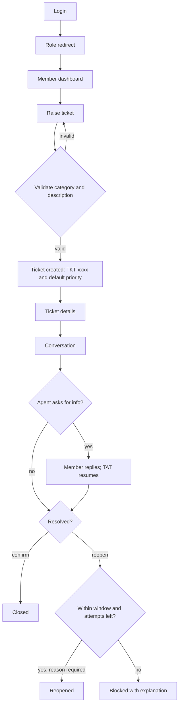
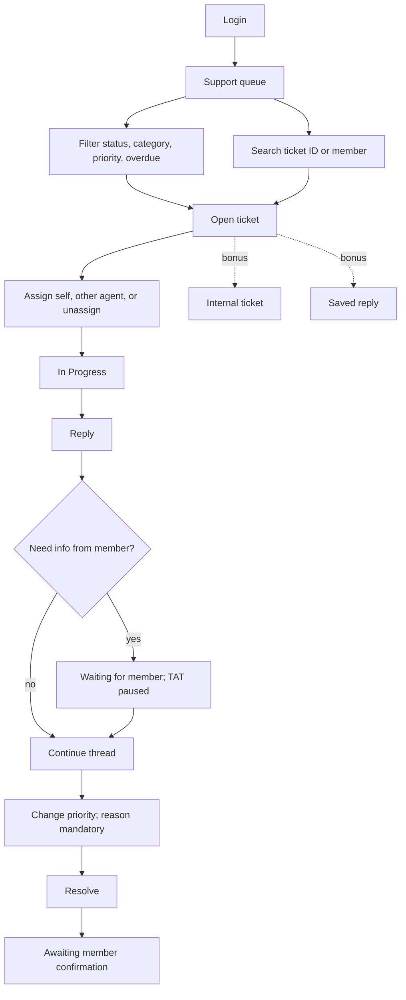
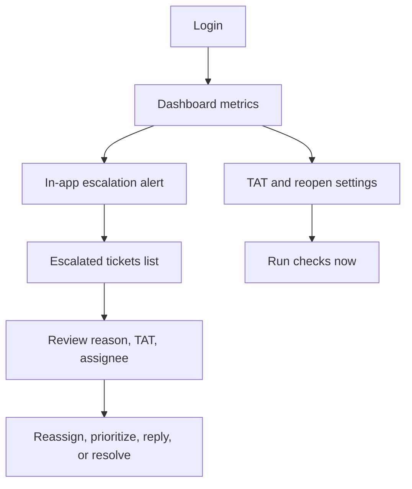
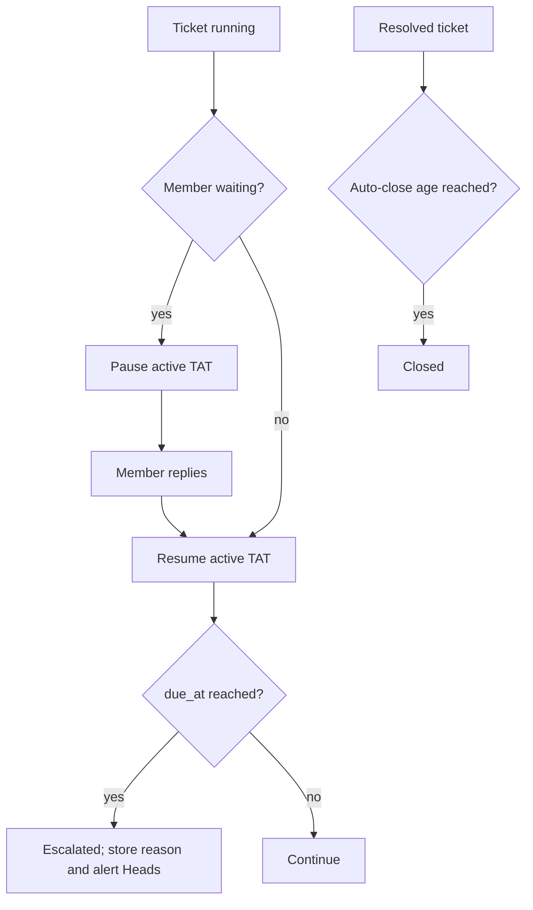
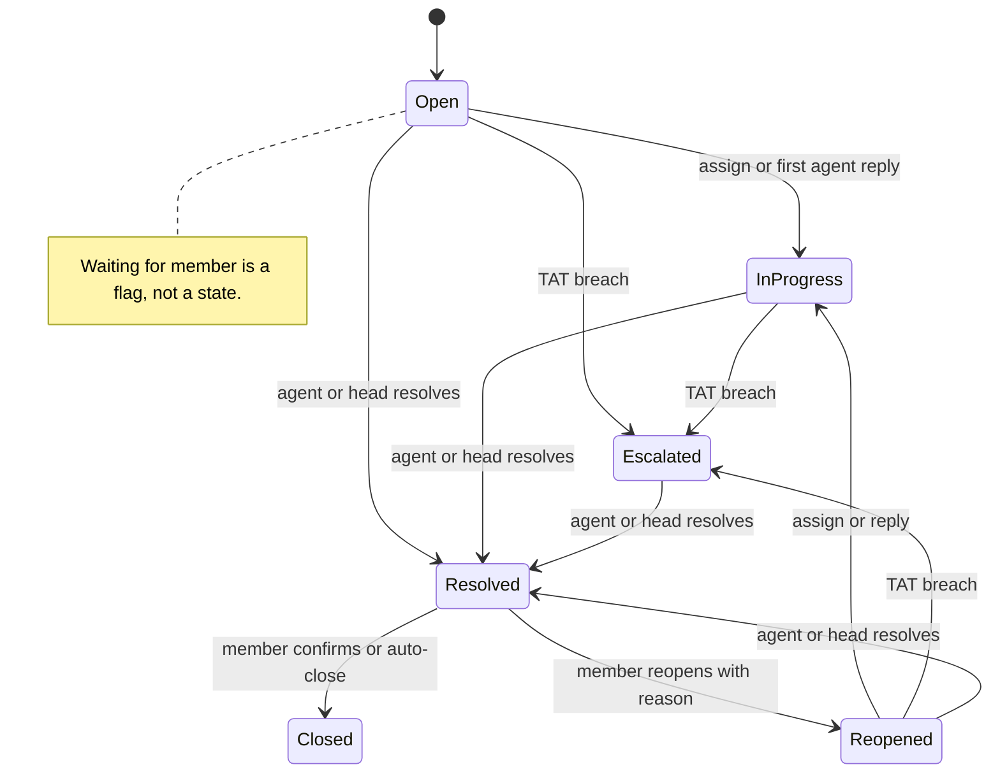

# User flows

## Member

```mermaid
flowchart TD
  M1[Login] --> M2[Role redirect]
  M2 --> M3[Member dashboard]
  M3 --> M4[Raise ticket]
  M4 --> M5{Validate category and description}
  M5 -->|valid| M6[Ticket created: TKT-xxxx and default priority]
  M5 -->|invalid| M4
  M6 --> M7[Ticket details]
  M7 --> M8[Conversation]
  M8 --> M9{Agent asks for info?}
  M9 -->|yes| M10[Member replies; TAT resumes]
  M9 -->|no| M11{Resolved?}
  M10 --> M11
  M11 -->|confirm| M12[Closed]
  M11 -->|reopen| M13{Within window and attempts left?}
  M13 -->|yes; reason required| M14[Reopened]
  M13 -->|no| M15[Blocked with explanation]
```

## Agent

```mermaid
flowchart TD
  A1[Login] --> A2[Support queue]
  A2 --> A3[Filter status, category, priority, overdue]
  A2 --> A4[Search ticket ID or member]
  A3 --> A5[Open ticket]
  A4 --> A5
  A5 --> A6[Assign self, other agent, or unassign]
  A6 --> A7[In Progress]
  A7 --> A8[Reply]
  A8 --> A9{Need info from member?}
  A9 -->|yes| A10[Waiting for member; TAT paused]
  A9 -->|no| A11[Continue thread]
  A10 --> A11
  A11 --> A12[Change priority; reason mandatory]
  A12 --> A13[Resolve]
  A13 --> A14[Awaiting member confirmation]
  A5 -. bonus .-> A15[Internal ticket]
  A5 -. bonus .-> A16[Saved reply]
```

## Support Head

```mermaid
flowchart TD
  H1[Login] --> H2[Dashboard metrics]
  H2 --> H3[In-app escalation alert]
  H3 --> H4[Escalated tickets list]
  H4 --> H5[Review reason, TAT, assignee]
  H5 --> H6[Reassign, prioritize, reply, or resolve]
  H2 --> H7[TAT and reopen settings]
  H7 --> H8[Run checks now]
```

## System and escalation

```mermaid
flowchart TD
  S1[Ticket running] --> S2{Member waiting?}
  S2 -->|yes| S3[Pause active TAT]
  S3 --> S4[Member replies]
  S4 --> S5[Resume active TAT]
  S2 -->|no| S5
  S5 --> S6{due_at reached?}
  S6 -->|yes| S7[Escalated; store reason and alert Heads]
  S6 -->|no| S8[Continue]
  S9[Resolved ticket] --> S10{Auto-close age reached?}
  S10 -->|yes| S11[Closed]
```

## Status lifecycle

```mermaid
stateDiagram-v2
  [*] --> Open
  Open --> InProgress: assign or first agent reply
  Reopened --> InProgress: assign or reply
  Open --> Escalated: TAT breach
  InProgress --> Escalated: TAT breach
  Reopened --> Escalated: TAT breach
  Open --> Resolved: agent or head resolves
  InProgress --> Resolved: agent or head resolves
  Reopened --> Resolved: agent or head resolves
  Escalated --> Resolved: agent or head resolves
  Resolved --> Closed: member confirms or auto-close
  Resolved --> Reopened: member reopens with reason
  note right of Open
    Waiting for member is a flag, not a state.
  end note
```

